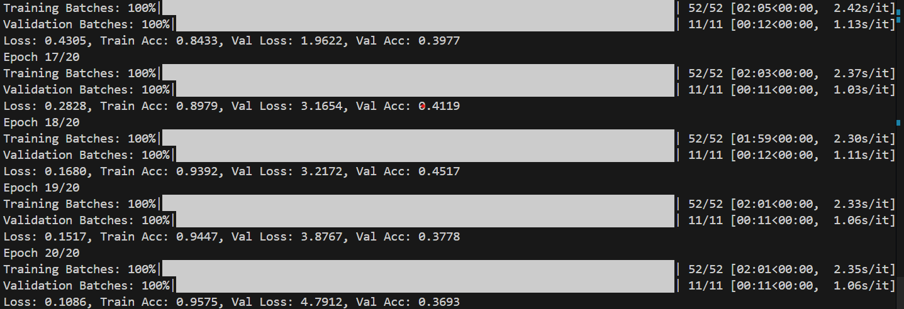

# Knee Osteoarthritis Classification Using CNNs

This repository contains my work on building a Convolutional Neural Network (CNN) model to classify the severity of knee osteoarthritis from X-ray images. The goal of this project was to apply deep learning techniques to analyze and score knee osteoarthritis severity based on the Kellgren-Lawrence (KL) grading system, using the [OSAIL Knee Osteoarthritis KL Scoring Dataset](https://www.kaggle.com/datasets/peymannejat/osail-knee-osteoarthritis-kl-scoring-dataset).

## Project Overview

The dataset contains labeled X-ray images, structured into five categories (0 to 4), each representing a level of osteoarthritis severity:
- **0**: No osteoarthritis
- **4**: Severe osteoarthritis

### Model Development
- **CNN Architecture**: 
  - Built a custom CNN model in **PyTorch** with layers optimized for feature extraction, dimensionality reduction, and classification.
  - The architecture includes convolutional, pooling, and dropout layers, followed by fully connected layers and a softmax output layer.
- **Loss Function and Optimization**:
  - Used **Cross-Entropy Loss** for multi-class classification.
  - Employed **Adam optimizer** with learning rate scheduling for adaptive training.

### Training and Evaluation
- **Progress Tracking**: Implemented `tqdm` to monitor the progress of each epoch, providing feedback on training and validation performance in real-time.
- **Evaluation Metrics**: 
  - Tracked **accuracy** and **loss** across training and validation datasets to gauge the model’s convergence and generalization capabilities.
  - Generated training and validation loss/accuracy curves, which displayed smooth convergence and minimal overfitting by the final epochs.
  - To assess the model’s performance, I calculated the training and validation accuracy and loss for each epoch.
  - I used plots to visualize the model's performance over epochs, specifically tracking both training and validation loss and accuracy.

### Results
- **Performance Visualization**: I visualized the training and validation loss/accuracy across epochs. The plots show consistent learning, with validation metrics closely following training performance, indicating strong model generalization.
- **Final Accuracy**: Achieved a satisfactory accuracy on the test set, validating the CNN’s capability in categorizing osteoarthritis severity effectively. With the final training and validation accuracy being as shown in the screenshot below.

> Screenshot shows the final results from my training

## Tools and Libraries Used
- **PyTorch**: For building and training the CNN model.
- **TQDM**: For displaying real-time progress in the training loop.
- **Matplotlib**: For visualizing training/validation performance metrics.
- **NumPy**: For data transformations and handling.

## Key Learnings and Insights
- **Data Management**: Handling and organizing medical imaging data is crucial to ensuring balanced and unbiased performance.
- **Model Training**: Regularization techniques such as dropout helped mitigate overfitting, critical given the limited dataset size.
- **Evaluation**: Continuous evaluation with training/validation loss and accuracy provided insights into model stability and potential improvements.

## Future Work
In future iterations, I plan to:
1. **Apply Data Augmentation**: To further improve generalization by adding rotation, scaling, and flipping.
2. **Experiment with Deeper Architectures**: Explore deeper CNNs or transfer learning approaches for potential performance boosts.
3. **Advanced Metrics**: Consider precision, recall, and F1 score to better understand classification performance across KL grades.
4. **Hyperparameter tuning**: We would tune the parameters particularly with respect to learning rate and layer configurations, to enhance performance.
